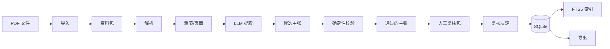

# Architecture — 文献证据 Agent

## 整体架构

```
CLI (Typer)
  ├── ingest   → 文件验证 → SHA-256 → 资料包 → SQLite
  ├── parse    → pdfplumber → 页面 → 章节 → Markdown
  ├── extract  → Mock/DeepSeek Provider → 主张提取
  ├── validate → Schema + Quote + Locator + Leakage
  ├── review   → CSV/HTML 复核包 → 应用决定
  ├── search   → FTS5 → 全文搜索
  └── export   → Markdown/JSONL 导出
```

## 数据流



## 数据库

SQLite 3 + FTS5 全文检索。详见 `docs/database_design.md`。

## 外部数据身份

所有来源表通过 CHECK 约束保证：
- `origin_scope = 'external'`
- `scientific_verification_status = 'unverified'`（第一轮）

Pydantic 模型层面也有相同的 validator。
