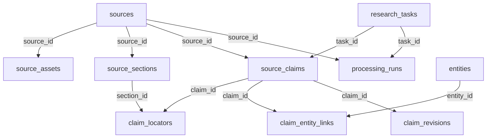

# Database Design — 文献证据数据库设计

> 版本：v1.0 | 日期：2026-07-10

## 1. 概览

- **数据库**: SQLite 3
- **文件**: `workspace/external_evidence/evidence.sqlite`
- **Pragma**: `foreign_keys = ON`, `journal_mode = WAL`, `synchronous = NORMAL`
- **全文检索**: FTS5

## 2. 表结构（共 11 张表 + 2 个 FTS 虚拟表）

### 2.1 `research_tasks` — 研究任务

### 2.2 `sources` — 文献来源（含 SHA-256 唯一约束）

### 2.3 `source_assets` — 原始文件记录

### 2.4 `source_sections` — 解析后的章节

### 2.5 `source_claims` — 核心主张表（含 CHECK 约束保证 origin_scope=external）

### 2.6 `claim_locators` — 主张定位

### 2.7 `entities` — 材料/方法/性质实体

### 2.8 `claim_entity_links` — 主张-实体关联

### 2.9 `processing_runs` — 处理运行元数据

### 2.10 `review_decisions` — 人工复核决定

### 2.11 `claim_revisions` — 主张修订历史

### FTS5: `source_fts` + `claim_fts`

完整 SQL 参见迁移文件：`migrations/001_initial.sql`, `migrations/002_fts.sql`, `migrations/003_constraints.sql`

## 3. 外键关系

## 4. 数据隔离规则

1. `origin_scope` 固定为 `external`（CHECK 约束）
2. `scientific_verification_status` 初始固定为 `unverified`
3. 第一轮代码不得写入除 `unverified` 外的科学验证状态
4. 导出必须标注「外部来源，未经内部验证」
